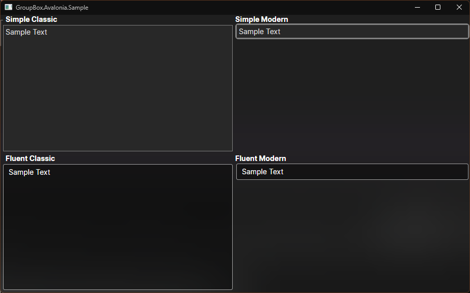

# GroupBox.Avalonia

Another attempt to recreate the GroupBox control for AvaloniaUI. This is based on @derekantrican's Classic and Modern GroupBox examples at [[GroupBox] Missing · Issue #823 · AvaloniaUI/Avalonia](https://github.com/AvaloniaUI/Avalonia/issues/823#issuecomment-692270581).

# Known Issues

- Simple Classic border does not render correctly.
- Fluent Classic border does nothing at all.