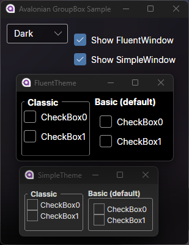
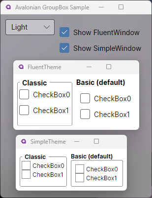

<!-- Unfortunately, the AvaloniaUI badge is updated via the Release workflow instead of via Shields.io and NuGet's API. -->

<div align="center">
  <div style="display:grid">
    
    <div style="
      grid-area: 1/1;
      margin: 3em 0 2em 0;
      padding: 0em 6em;
      place-self: center center;">

[](https://github.com/semantic-release/semantic-release)
[](https://github.com/AvaloniaUI/Avalonia)

[](https://github.com/BinToss/GroupBox.Avalonia/actions/workflows/ci.yml)
[](https://github.com/BinToss/GroupBox.Avalonia/actions/workflows/release.yml)

[](https://www.nuget.org/packages/BinToss.GroupBox.Avalonia/)
[)](https://www.nuget.org/packages/BinToss.GroupBox.Avalonia/#versions-body-tab)
    </div>
  </div>
</div>

# GroupBox.Avalonia

</p>

Another attempt to recreate the GroupBox control for AvaloniaUI.

Based on @derekantrican's Classic and Modern GroupBox examples at [[GroupBox] Missing · Issue #823 · AvaloniaUI/Avalonia](https://github.com/AvaloniaUI/Avalonia/issues/823#issuecomment-692270581).

When this library is production-ready, its themes/styles _may_ be pull-requested to teast/Avalonia.GroupBox. Otherwise, someone else will need to maintain this project.




# Known Issues

- Sample app re-distributes the checkbox labels...weirdly.

# Usage

1. Add the package: <https://www.nuget.org/packages/BinToss.GroupBox.Avalonia/>

    ```sh
    dotnet add package BinToss.GroupBox.Avalonia
    ```

2. In an AXAML/XAML file, add the following xmlns statement: `xmlns:gb="using:GroupBox.Avalonia.Controls"`. I used `ctrl` in the sample project, but other projects should use `gb`.
    <https://github.com/BinToss/GroupBox.Avalonia/blob/5515704496a0103200733b788bcfcad1c1ce5ea1/GroupBox.Avalonia.Sample/Views/MainView.axaml#L1-L5>

3. Add a basic GroupBox via `<gb:GroupBox/>`
    <https://github.com/BinToss/GroupBox.Avalonia/blob/5515704496a0103200733b788bcfcad1c1ce5ea1/GroupBox.Avalonia.Sample/Views/MainView.axaml#L25-L31>

    For its contents, you should use a `Panel`-based `Control` such as `Grid` or `StackPanel`. It's a *Group*Box, after all.

4. (Optional) To use the "classic" theme replicating Windows' classic GroupBox, use `Theme="{StaticResource GroupBoxClassic}"`
    <https://github.com/BinToss/GroupBox.Avalonia/blob/5515704496a0103200733b788bcfcad1c1ce5ea1/GroupBox.Avalonia.Sample/Views/MainView.axaml#L16-L18>

---

For more info, see [GroupBox.Avalonia.Sample](https://github.com/BinToss/GroupBox.Avalonia/tree/main/GroupBox.Avalonia.Sample).
